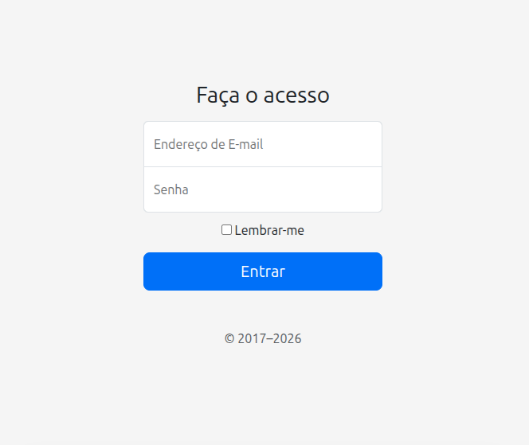

<h1 align="center"> 🚀 Projeto em Construção - Tela de Login  </h1>

  

  
  
  
  

# 📃 Descrição
Projeto sendo criado na disciplina de Programação Front-End, na Unicesumar, campus Londrina. O professor [Leonardo Rocha](https://github.com/leonardossrocha) introduziu os conceitos de framework,apresentando o Bootstrap e implementamos Tela de Login como exemplo de Framework, além do Git, realizando o passo a passo da configuração do ambiente de desenvolvimento.

## ⚙️ Funcionalidades
- Tela de Login (E-mail e Senha)
- FAQ (dúvidas gerais de login)

## 🛠️ Comandos do Git no Terminal

- `git status`: Mostra o estado atual do repositório.
- `git clone`: Cria uma cópia local de um repositório remoto.
- `git add`: Adiciona arquivos à área de preparação.
- `git commit -m`: Cria um registro permanente das alterações adicionadas com `git add`.
- `git push`: Envia os commits locais para o repositório remoto.
- `git pull`: Atualiza projeto existente.

## 🚀 Link do meu projeto acadêmico!

1. Clone este repositório:
~~~ shell
   git clone https://github.com/umRangel/projeto-login.git
~~~

### 🎩 Autor
[Ricardo Rangel Piantek](https://linkedin/in/rangel-piantek)